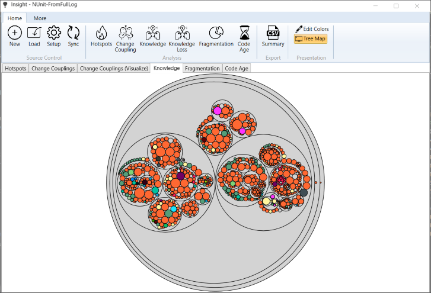

# Insight - An commit history analyzer.

This utility implements some of the ideas presented in Adam Tornhill's great book "Your Code as a Crime Scene".

Currently, it supports Subversion and Git. Note that processing a Git history is quite slow.
Supported file types (for counting lines of code) are cs, cpp, c, h, java, xaml and xml

## Screenshots

### Show hotspots
Hotspots can be visualized via tree map or circle packaging.

A hotspot is a large file (lines of code) that changes frequently. 

This is quite common for configuration files, string resources, designer generated files, etc. 
But the change frequency combined with the large size may also be a hint that the file contains too many responsibilities. Such a hotspot may be a candidate to refactor.

There is a principle in software development called the single responsibility principle (SRP). It says that a class (file) should have only one reason to change. If the file changes often combined with the large size, this may be a hint that the file contains too many responsibilities.

This is a disadvantage for two reasons. First, you need more time to understand this file. Since a software developer usually spends more time reading and understanding code than writing it, this is a waste of time.

Second, if you have to make modifications in a file with interwoven code serving different tasks there is a higher risk that you break an unrelated feature Y when working on feature X.

The utility helps you to find these hotspots.

In the visualizations, the area of a rectangle or innermost circle corresponds to the size of a file (lines of code). The color corresponds to the change frequency. 

### Show file trends

### Show change couplings

Files that frequently change together can be visualized in a chord diagram.

There are many cases when modifying a file leads to modification in another one. Examples are classes and their unit tests, user interfaces and their view models, etc.

However, making this commit pattern visible can give interesting insights into the code.

When two files are often changed at the same time, it can also mean that abstraction is missing - causing duplicated work. Or maybe it is just because of copied and pasted code that needs to be maintained twice now. This is dangerous because it is easy to introduce bugs by missing code to update.

This kind of analysis can also make dependencies visible that no static code checker can find. Think of an encryption/decryption pair of functions. If you change one, you need to update the other one, too.

Change coupling analysis can raise interesting questions because it takes a different look at the source code.

### Show knowledge

Again, a rectangle or inner most circle represents a file in the repository. Additionally, a unique color is assigned to each developer. The file is then drawn in the color of the developer who contributed most to its content.

This visualization allows you to see how the knowledge is distributed over the project. 

# How to build

* To count lines of code an external tool is used. Download cloc-1.84.exe from https://github.com/AlDanial/cloc/releases/ and copy it to the directory Binaries\ExternalTools.
* Build Insight.sln (I use Visual Studio 2019). All output is generated in the Binaries directory.

# How to use

Note: svn.exe or git.exe have to be found in the search path. 
If you use TortoiseSVN take care that the "Command line client tools" are installed.

* Start Binaries\Insight.exe
* Click Setup and select the root folder of the project you want to analyze. Also, specify a cache directory. Create an empty directory for each project you want to analyze. The application uses this directory to cache files downloaded from the version control and uses it as output directory for CSV exports.
* Click Sync to obtain the history from the version control and calculate some metrics for the files in the project directory. All collected information is stored in the Cache directory and is used later.
Before you click Sync your working copy should be up to date.
* Now the functions in the Analysis group are available.

# Resources

## Icons

Icons made by <a href="http://www.freepik.com" title="Freepik">Freepik</a> from <a href="https://www.flaticon.com/" title="Flaticon">www.flaticon.com</a> is licensed by <a href="http://creativecommons.org/licenses/by/3.0/" title="Creative Commons BY 3.0" target="_blank">CC 3.0 BY</a>
Icons made by <a href="https://www.flaticon.com/authors/gregor-cresnar" title="Gregor Cresnar">Gregor Cresnar</a> from <a href="https://www.flaticon.com/" title="Flaticon">www.flaticon.com</a> is licensed by <a href="http://creativecommons.org/licenses/by/3.0/" title="Creative Commons BY 3.0" target="_blank">CC 3.0 BY</a>
Icons made by <a href="https://www.flaticon.com/authors/catalin-fertu" title="Catalin Fertu">Catalin Fertu</a> from <a href="https://www.flaticon.com/" title="Flaticon">www.flaticon.com</a> is licensed by <a href="http://creativecommons.org/licenses/by/3.0/" title="Creative Commons BY 3.0" target="_blank">CC 3.0 BY</a>
Icons made by <a href="https://www.flaticon.com/de/autoren/darius-dan" title="Darius Dan">Darius Dan</a> from <a href="https://www.flaticon.com/de/" title="Flaticon"> www.flaticon.com</a>

## Libraries

<a href="https://github.com/AlDanial/cloc">Cloc - Count lines of code</a>
You have to download it from <a href="https://github.com/AlDanial/cloc/releases/tag/v1.76">GitHub</a>

<a href="http://code.msdn.microsoft.com/WindowsAPICodePack">Windows® API Code Pack</a>

<a href="https://github.com/EricOuellet2/ConvexHull">Eric Ouellet's Convex Hull</a>
See also <a href="https://www.codeproject.com/Articles/1210225/Fast-and-improved-D-Convex-Hull-algorithm-and-its">Fast and improved 2D Convex Hull algorithm and its implementation</a>

<a href="http://www.oxyplot.org/">OxyPlot</a>

<a href="https://github.com/libgit2/libgit2sharp">LibGit2Sharp</a>

