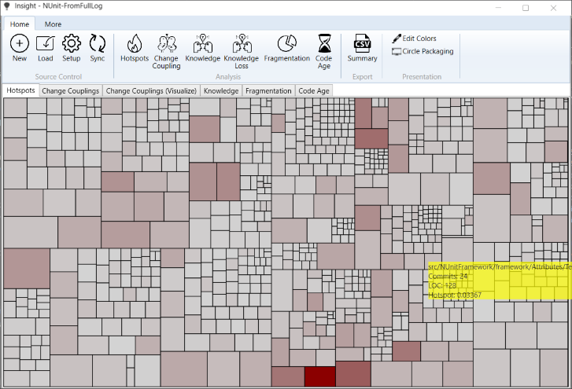
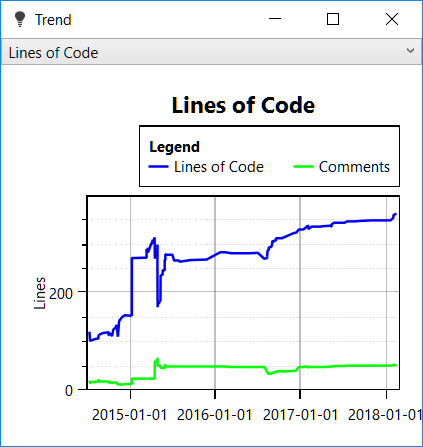

# Insight - A commit history analyzer.

This utility implements some of the ideas presented in Adam Tornhill's great book "Your Code as a Crime Scene".

Currently, it supports Subversion and Git. 

Note that processing a Git history such that file movements are considered is quite slow.

Supported file types (for counting lines of code) are cs, cpp, c, h, java, py, xaml and xml

## Features
You can toggle all hierarchical visualizations between treemaps and circle packaging.

### Show hotspots
This analysis is the most exciting feature for which I originally wrote the tool. 
The hotspot analysis gives you a quick overview of where your codebase requires your attention.

The definition of a hotspot is a file that frequently changes and(!) has large "lines of code" metric.

Now, while each of these metrics is a weak predictor for code smells on its own, the two combined are often a good indicator that a code file starts to erode. The definition applies, of course, to harmless files, too, like configuration files, string resources, designer generated files, etc.  But a high change frequency combined with the large size also quite accurately finds files that are candidates for refactoring.

What is the reasoning behind this?

There is a principle in software development called the single responsibility principle (SRP). It says that a class (file) should have only one reason to change. If the file changes often combined with the large size, this may be a hint that the file contains too many responsibilities.

This is a disadvantage for two reasons. 

First, you need more time to understand this file. As a software developer you usually spend more time reading and understanding code than writing it. So hotspots contribute to a codebase challenging to understand and difficult to maintain.

Second, if you have to make modifications in a file with many responsibilities, there is a higher risk that you break an unrelated feature Y when working on feature X.

There is also another principle called the Open Close Principle (OCP). It states that you should try to structure your code so that you can add new features by adding new code rather than changing existing code. If you commit a file often (working on different features), this may indicate that you can improve your code regarding the OCP by refactoring the varying parts out of it.

The utility helps you to find these hotspots quickly.
In the visualizations, the area of a rectangle or innermost circle corresponds to a file's size (lines of code). The color corresponds to the change frequency. So to find hotspots, you search for large and dark areas. Use the mouse to hover over the shapes to get a tooltip with additional information.

The cool thing is that this kind of analysis works independently of the language you use.

### Show file trends

File trends show you the comments and lines of code over time. You can open this view via context menu.

### Show change couplings

You can show files that frequently change together in a chord diagram. You have to select the files to visualize in the textual analysis result. The context menu then opens the visualization.

There are many cases when modifying a file leads to modification in another one. Examples are classes and their unit tests, user interfaces and their view models, etc.

However, making this commit pattern visible can give interesting insights into the code.

When two files are often changed at the same time, it can also mean that abstraction is missing - causing duplicated work. Or maybe it is just because of copied and pasted code that needs to be maintained twice now. This is dangerous because it is easy to introduce bugs by missing code to update.

This kind of analysis can also make dependencies visible that no static code checker can find. Think of an encryption/decryption pair of functions. If you change one, you need to update the other one, too.

Change coupling analysis can raise interesting questions because it takes a different look at the source code.

### Show knowledge

Again, a rectangle or innermost circle represents a file in the repository. Additionally, the tool automatically assigns a color to each developer. The files are drawn in the color of the developer who contributed most to its content.

This visualization allows you to see how knowledge distributes over the project. 

### Fragmentation and Code age

Code age analysis shows you where your codebase is stable and does not change anymore.

Fragmentation is a metric that goes up when many developers change the same file. The idea behind this analysis is that when too many people contribute to a file, you end up with a file nobody feels responsible for. At least that is my experience.

# How to build

* To count lines of code an external tool is used. Download cloc-1.88.exe from https://github.com/AlDanial/cloc/releases/ and copy it to the directory Binaries\ExternalTools.
* Build Insight.sln (Visual Studio 2019). All output is generated in the Binaries directory.

# How to use

Note: svn.exe or git.exe have to be found in the search path. 
If you use TortoiseSVN take care that the "Command line client tools" are installed.

* Start Binaries\Insight.exe
* Click "New" and select the root folder of the project you want to analyze (Source Control Base). 
  Also, specify an existing "Project parent directory" and a "Project name" for your analysis. This creates a new directory Parent_Directory/Project_Name. In this directory all generated artifacts used for the analysis are stored. It is also the output directory for CSV exports. Click "Ok" to complete the new analysis project.

  

* Click Update to obtain the history from the version control and calculate some metrics for the files in the project directory. All collected information is stored in the project directory and is used later.
Before you click Update your working copy should be up to date.
* Now the functions in the Analysis group are available.

Note for GIT users: 
If you rename and modify a file in the same commit, following the file through the commit history does not work correctly. If such a situation happens, I restart and handle the renamed file as a new file.

# Resources

## Icons

Icons made by <a href="http://www.freepik.com" title="Freepik">Freepik</a> from <a href="https://www.flaticon.com/" title="Flaticon">www.flaticon.com</a> is licensed by <a href="http://creativecommons.org/licenses/by/3.0/" title="Creative Commons BY 3.0" target="_blank">CC 3.0 BY</a> 
Icons made by <a href="https://www.flaticon.com/authors/gregor-cresnar" title="Gregor Cresnar">Gregor Cresnar</a> from <a href="https://www.flaticon.com/" title="Flaticon">www.flaticon.com</a> is licensed by <a href="http://creativecommons.org/licenses/by/3.0/" title="Creative Commons BY 3.0" target="_blank">CC 3.0 BY</a> 
Icons made by <a href="https://www.flaticon.com/authors/catalin-fertu" title="Catalin Fertu">Catalin Fertu</a> from <a href="https://www.flaticon.com/" title="Flaticon">www.flaticon.com</a> is licensed by <a href="http://creativecommons.org/licenses/by/3.0/" title="Creative Commons BY 3.0" target="_blank">CC 3.0 BY</a> 
Icons made by <a href="https://www.flaticon.com/de/autoren/darius-dan" title="Darius Dan">Darius Dan</a> from <a href="https://www.flaticon.com/de/" title="Flaticon"> www.flaticon.com </a>

## Libraries

<a href="https://github.com/AlDanial/cloc">Cloc - Count lines of code</a>
You have to download it from <a href="https://github.com/AlDanial/cloc/releases/download/1.88/cloc-1.88.exe">GitHub</a>

<a href="https://www.nuget.org/packages/WindowsAPICodePack-Core/">Windows® API Code Pack</a>

<a href="https://github.com/EricOuellet2/ConvexHull">Eric Ouellet's Convex Hull</a>
See also <a href="https://www.codeproject.com/Articles/1210225/Fast-and-improved-D-Convex-Hull-algorithm-and-its">Fast and improved 2D Convex Hull algorithm and its implementation</a>

<a href="https://github.com/oxyplot/oxyplot">OxyPlot</a>

<a href="https://github.com/libgit2/libgit2sharp">LibGit2Sharp</a>

